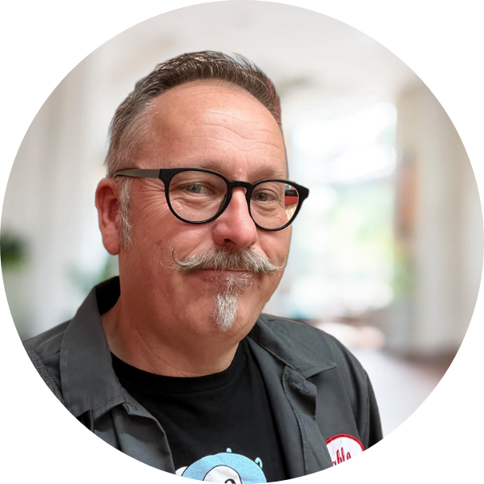
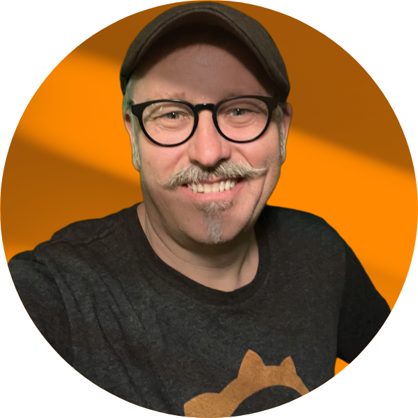
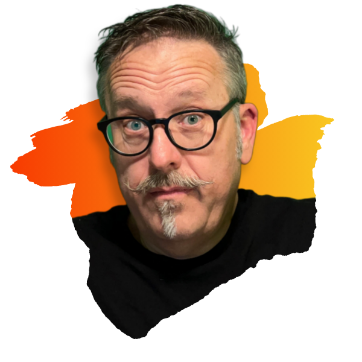
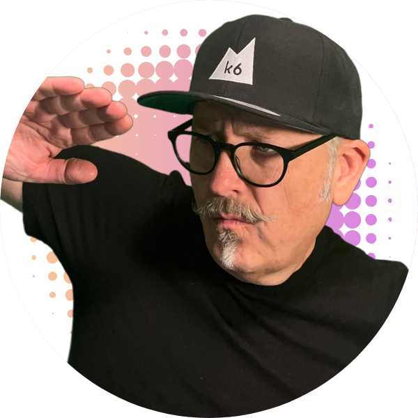

## Interested in having me as a speaker?

Would you like to discuss having me speak at your event? It's a definite _maybe_! Please reach out to me first, then [book some time that we can talk about it](https://calendly.com/cloudgnome/15min).

## Speaker Bio:

Paul is a CNCF Ambassador, GoBridge Ambassador, and a Developer Advocate at Grafana Labs. In this role, he encourages developers and testers alike to "shift left," bringing reliability testing earlier in the software development process. He's been a software engineer/architect for over 25 years, programming in various languages and platforms. Working with the open source community around cloud technologies like k6, Kubernetes, and Kafka, among others, keeps him young, as do his interests in punk rock music and playing bass guitar.

## Profile Images:

Need an image of me for an event? I've got [several to choose from](images/), many of which were generated thanks to [PFP Maker](https://app.pfpmaker.com/).

Here are some of my favorites:

   
